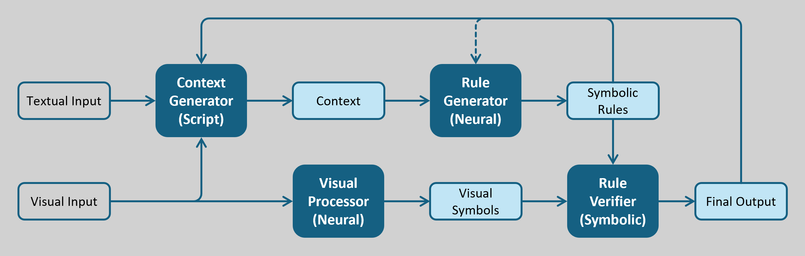

# Neuro-Symbolic Artificial Intelligence for Visual Reasoning via Dynamic Logic Tensor Networks

## A Bit of History

 If you're new to Artificial Intelligence (AI), you might think Neural Networks (NNs) are the whole story. You might even believe AI and NNs are practically the same thing. Well, you're almost right! In a way, that's a fair assumption if we're talking <i>modern AI</i>, which is basically a love letter to neural methods. In fact, most of the field is obsessed with training and tweaking those glorious neurons. However, the history of AI tells a bit different story. Once upon a time, AI was all about <i>logical rules</i>, fondly known as <a href="https://en.wikipedia.org/wiki/GOFAI">Good-Old-Fashioned AI (GOFAI)</a>. And, my goodness, those methods worked like a charm! For instance, they powered expert systems that could reason through problems with the precision of a mathematician solving a crossword puzzle.

 
  
 <i>From "<a href="https://billwadge.com/2024/02/12/the-rise-and-fall-of-gofai/">The Rise and Fall of GOFAI</a>" by Bill Wadge</i>

 However, these days, GOFAI is like that retro band in the '90s; rarely heard but fondly remembered. So, what happened? Did we ditch it? Like all good things, GOFAI birthed modern AI and then slipped into the shadows. Why? Well, NNs swooped in with their data-crunching superpowers, learning everything from cat pics to quantum physics <i>without needing hand-crafted rules</i>. They were flashy, flexible, and frankly, too cool to resist. Also, GOFAI's rigid logic <i>couldn't keep up</i> with the big data party, so it took a backseat. But now, as we teeter on the edge of Artificial General Intelligence (AGI), we're dusting off GOFAI's playbook. Those logical roots are making a comeback, because, let's face it, learning is great, but reasoning like a human is <i>the real jackpot</i>. After all, as the old saying goes, <q>the creaking gate hangs longest</q>. So, buckle up for a new brand of AI!

## NeSy AI

 How did we revive GOFAI? Enter Neuro-Symbolic (NeSy) AI, the <i>lovechild</i> of NNs and symbolic reasoning. You already know NNs, so let's talk about the other half. Symbolic reasoning is the art of <i>thinking with symbols</i>, like a brainy game of chess where each piece stands for something meaningful, like <i>pawn</i>, <i>knight</i>, or <i>queen</i>. A symbol, in this context, is a tidy little <i>package of meaning</i>, which could be a word, number, or concept that represents something in the real world. For example, picture a robot spotting a furry creature and reasoning: <i>Furry + meows = probably a cat, not a toaster</i>. That's symbolic reasoning at work, using clear-cut rules to make sense of the world.

 NeSy AI <i>marries</i> this logical wizardry with a NN's knack for spotting patterns in messy data, like recognizing a cat in a blurry photo, which means giving your NN a PhD in logic while keeping its data-crunching vibes. Cool, right? It becomes even cooler to know this combo works for a good reason. Cognitive science tells us our brains use <i>two systems</i> for thinking. System 1, the <i>Homer Simpson of AI</i>, is your gut instinc; quick, intuitive, and great at spotting patterns in data to apply to new situations. System 2, the <i>Sherlock Holmes of AI</i>, is your beautiful problem-solving mind; deep, deliberate, and powerful at reasoning. NeSy does both: its neural part learns from data (System 1) and its symbolic part reasons about it (System 2). But, how do we actually do NeSy AI?

## NeSy Frameworks

 Over the past few years, a <i>parade</i> of NeSy methods has marched onto the scene. Since NeSy is more a <i>paradigm</i> than a single trick up the AI sleeve, these methods double as frameworks, each with its own quirky way of blending NNs with symbolic reasoning. Want the full scoop? Check out <a href="https://harshakokel.com/posts/neurosymbolic-systems/">Types of Neuro-Symbolic Systems</a>, which lays out <i>Kautz's six-level taxonomy of NeSy</i>. The big takeaway? These frameworks aren't just slapping neural and symbolic together like a sandwich; they're <i>carefully engineering systems</i> to reason and learn in harmony. For a deeper dive, also sneak a peek at <a href="https://arxiv.org/abs/2305.00813">Neurosymbolic AI - Why, What, and How</a>.

 The kicker? Training a NeSy system isn't your typical NN <i>rodeo</i>. Take, for example, the task I tackled in my thesis: <a href="https://par.nsf.gov/servlets/purl/10440135">Visual Sudoku Puzzle Classification</a>. Picture a pile of labeled correct and incorrect Sudoku boards, where the model learns to classify them, but with a big twist: the supervision is only on the <i>labels</i> not the digits themselves. Oh, and the digits might not even be numbers. They can be English letters, Japanese signs, or even fashion items. Tricky, right? I'll spill more details on this puzzle later. The point is, NeSy systems shine when trained end-to-end, weaving together learning and reasoning like a cosmic tapestry.

 Among these frameworks, my personal favorite is <a href="https://arxiv.org/abs/2012.13635">Logic Tensor Networks</a>, which is actually the one I worked on during my thesis. To get LTNs, we first need to know First-Order Logic (FOL). Think of it as the language of logic, letting us craft statements like, <i>If it's furry and meows, it's a cat</i> or <i>is_furry(x) & is_meowing(x) → is_cat(x)</i>. The latter is an FOL statement: a tidy rule for reasoning. LTNs take these FOL statements and magically transform them into NNs. Train that network, and boom! The logical rule gets applied to any data you throw at it.

 Now, you might wonder how these rigid binary FOL statements fit into the squishy floating-point world of NNs. That's where it gets interesing. You know <a href="https://en.wikipedia.org/wiki/Fuzzy_logic">Fuzzy Logic</a>, yeah? That's how! The brilliance of LTNs comes from <i>grounding</i>; a process that relaxes those hard all-or-nothing statements into something softer and more flexible. For example, take a statement like <i>y = a & b</i>. LTNs use fuzzy logic to encode this into a NN, allowing it to handle uncertainty and partial truths, like a wise sage navigating life's gray areas.

## Challenge

 NeSy systems are the bee's knees, and some even believe the next paradigm shift in AI will come courtesy of NeSy. But, another old saying goes, <q>every coin has two sides</q>. There are still hurdles to jump, and for my thesis, I focused on a triple-threat challenge in current NeSy visual reasoning systems. Some approaches are slick but stubborn, locked into a fixed set of logical rules with zero wiggle room to adapt to new ones. Others are more flexible, dynamically extracting underlying logical rules from data; but good luck explaining how they got there or what they even are! Newer systems have tried to bridge this gap, but their rules lack formality; meaning they're too wordy for machines to verify without a human poking around. So, the million-dollar question is: can we build a NeSy system for visual reasoning that's flexible, explainable, and formal, all at once?

## Conceptual Solution

 My general idea to crack this challenge is the system sketched below. It kicks off with two inputs: textual data (instructions or descriptions) and visual data (the actual images). These get tossed into a context generator, which mashes them together into a unified context. From there, a rule generator grabs this context and whips up symbolic rules. Meanwhile, the visual input also feeds into a visual processor to cook up visual symbols. Then, a rule verifier swoops in, applying those symbolic rules to the visual symbols to deliver the final output.

 

 Now, here's where the party starts: the final output loops back into the context generator, acting like a mid-game coach dishing out feedback. This means the system can spot its own fumbles and fix them on the fly; sort of inspired by Reinforcement Learning (RL). Plus, the rule generator itself gets in on the feedback action, tweaking its own rules if things go off the rails. This setup nails the trifecta I mentioned earlier: it's flexible (adapts to different tasks), explainable (rules are in clear symbolic language, not a mathematical tensor nightmare), and formal (rules are machine-verifiable, no human babysitting required).

## Functional Solution

 Alright, let's get down to the nuts and bolts of how this idea comes to life. Depending on the functional designs you pick for each module described, there are many ways to pull this off. For my thesis, given the time and resources I had, I went for the simplest setup I could find, as shown in the figure below. I used a prompt engineer to carve prompts and act as the context generator. Then, a Vision Language Model (VLM) took those prompts and churned out symbolic rules in FOL. For the visual processor, I leaned on a straightforward Convolutional Neural Network (CNN) and used its output embeddings as the visual symbols. Finally, a Dynamic Logic Tensor Network (D-LTN) stepped up as the rule verifier to deliver the final output.

 

 While this functional setup might look simplistic at the first look, the D-LTN is the real MVP of my work. In that module, I dynamically convert symbolic rules into LTNs, which required building a parser for FOL and crafting an autonomous pipeline to train and test those D-LTNs. To make that happen, I used <a href="https://lark-parser.readthedocs.io/en/stable/">Lark</a> and sprinkled in some meta-programming magic to create a Python template that reads and understands FOL as a logic-loving compiler. This pipeline is the secret sauce, letting the system hum along smoothly while keeping flexible, explainable, and formality promises.

## Running the Codes

  Finally, it's time to get into buisniness. I have prepared a minimalistic implementation of this project in this repositoty. You can clone it locally or on cloud, but there's a better way. To simplify things, I've changed the codes to run on Google Colab, which means you'll also need to use your Google Drive, but not much of it. So, to begin, make a folder in your drive, and name it whatever you like. Let's say you call it <code>nesy</code> and put it in your home folder like a sane person. Then, simply copy <a href="data_collection.ipynb">data_collection.ipynb</a>, <a href="main_algorithm.ipynb">main_algorithm.ipynb</a>, and the <a href="">datasets</a> folder to it. That's it, you can run the codes now.

### Data Collection

 The notebook <a href="data_collection.ipynb">data_collection.ipynb</a> is for collecting the data used for the Sudoku task I was talking about. If you don't want to do this, you can skip this part. I've already collected the required data in the <a href="">datasets</a> folder. However, if you're curious, you can create your own dataset as well. 

### Main Algorithm

## Acknoledgement

